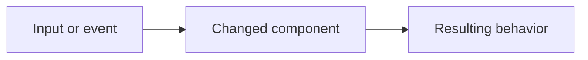

## Summary

<!-- Describe the problem and resulting behavior. For a bug fix, include a before/after example. -->

## Related issues

<!-- Use "Closes #123" for issues this PR resolves, or "Related to #123" for context. Remove if none. -->

## Changes

<!-- List the main changes and any compatibility, settings, or installation impact. -->

## Diagram (optional)

<!-- Replace the example with a flowchart or sequence diagram when it helps explain the change.
For performance comparisons, attach a chart with labeled axes and units instead.
Remove this section if it is not useful for this PR. -->

Change flow

## Validation

<!-- Describe what you checked and the results. Include commands and manual steps where useful.
For application changes, use the build and test guide in starter/README.md.
For asset changes, run python3 starter/scripts/verify_assets.py.
For documentation-only changes, checking links and formatting is enough.
Explain any relevant checks you could not run. -->

- Checks and results:
- Platforms tested (OS/version; X11 or Wayland on Linux, if relevant):
- Agent clients tested (Claude Code / Codex and version, if relevant):

## Screenshots or recordings

<!-- Attach before/after screenshots or a short recording for visible UI or animation changes. Remove if not applicable. -->

## Checklist

<!-- Check applicable items and remove those that do not apply. -->

- [ ] I reviewed the diff and completed the relevant validation above.
- [ ] I updated documentation for changes to behavior, settings, installation, or the event protocol.
- [ ] I updated English and Vietnamese translations for changed user-facing text.
- [ ] I preserved artwork licensing and notices for asset changes.
