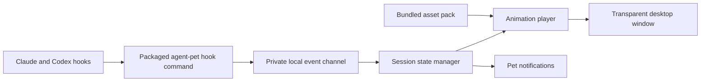

# Standalone Agent Pet plan

Updated 2026-10-04. This replaces the earlier proposal to extend the installed `vpet` command.

## Product and current state

Build an independently installable desktop companion. Users install Agent Pet, enable the Claude Code and/or Codex integration, and see the pet react to agent activity. All required artwork and runtime resources ship with the application.

Completed: copied the entire VUP character pack, preserved upstream terms and provenance, verified every copied file against its source, and added portable inventory tooling. This project directory can be moved intact into its own repository. The application is still to be built.

The self-contained [starter repository](starter/README.md) also includes a smaller pack: 180 PNG frames across 20 sequences, a state-to-animation map, an asset verifier, and a catalog of sequences available for future expansion. Use `starter/` as the application development base, following the root README. Paths in the implementation checklist below are relative to that directory unless stated otherwise. The full archive remains available in this workspace for future asset selection.

### Progress tracker

- [x] Import original artwork, metadata, provenance, and notices.
- [x] Add full-archive verification and animation catalog tooling.
- [x] Prepare the smaller standalone starter pack and verifier.
- [x] Choose the desktop shell and establish the application scaffold.
- [x] Implement animation playback and desktop controls.
- [x] Implement local events and session state management.
- [ ] Implement and validate both provider integrations.
- [ ] Implement compact pet alerts and minimal settings.
- [ ] Package and validate the first Linux release.

### First-release scope

Deliver a transparent, draggable pet with idle, thinking, reading, working, attention, error, turn-finished, and inactive states. Include settings for size, position, and integration management, plus a way to quit and recover from click-through mode. Startup and closing sequences should use the bundled artwork.

Agent Pet is a passive desktop companion for supported, connected agent clients across this machine. Users continue interacting with agents in their existing terminals/editors. The product UI consists of the floating pet, compact alert bubbles, and minimal settings/tray controls.

The [pet-only design](docs/design/README.md) defines the complete product interface: pet, alert bubble, attention badge, and context/tray menu.

#### Pet and notifications

- React to aggregate session activity internally. Prioritize approval/input requests and errors, then finished turns, then ordinary working/idle animation.
- Show compact alerts identifying the project, provider, short session ID, and reason, such as `fcis-web · Claude Code · b72c — Needs approval`. Include a project-path tooltip when available to disambiguate identical project names.
- Use a bounded alert queue with duplicate aggregation. Show one current bubble and a pending count; a small next control cycles pending alerts.
- Provide dismissal, mute, and optional sound. Dismissing an alert removes it from the visible queue without resolving the underlying session state. A small attention badge can persist while an observed request remains unresolved.
- Alerts provide Next and Dismiss controls. Users respond to agent requests in their existing host application.
- Minimal settings/tray controls cover size, position, notifications, integration setup/coverage, artwork attribution, and quit. Closing settings keeps monitoring active; quitting stops it. An always-running service is deferred.

#### Coverage and existing sessions

“Across this machine” means all sessions observed by enabled integrations in the current user's local environment, across supported hosts. It does not mean arbitrary process discovery, all OS users, remote hosts, containers, or every agent application.

A newly received event can create a session record even if SessionStart was missed. Already-running sessions are observed only if they subsequently emit events to an active integration. Whether integration changes apply to an existing client must be validated per client/version; a restart may be required. Show coverage and setup guidance explicitly. Do not promise to discover silent pre-existing sessions or reconstruct their earlier activity.

Keep bounded session state and pending alerts in memory. After monitor restart, wait for fresh events instead of restoring old activity or replaying old alerts. Persist only preferences and integration configuration. Time without events is not proof of completion or disconnection. Unsupported approval/input events must remain a documented coverage gap.

Defer Windows/macOS packages, additional characters, food/gift interactions, game mechanics, cloud synchronization, and automatic updates. Native Wayland support remains a prototype decision; document the tested desktop environments before release.

Initial release target: Linux desktop, with X11 and XWayland behavior tested explicitly. Keep the event protocol and asset format portable for later Windows and macOS packages. Choose the desktop shell after a small transparency, input, tray, and packaging prototype; native Wayland compatibility needs validation.

## Architecture

The app owns its window, animation player, state, settings, and launcher. Load resources relative to the installed package, with a project-relative lookup for development. The original VPet installation and checkout are not runtime dependencies. Persist only preferences and integration configuration in the platform's user data directory, outside installed resources. Session state and alerts remain in memory.

Provide `agent-pet hook --provider claude|codex` for agent callbacks and `agent-pet emit` for playback verification. Hook handlers parse stdin, normalize the event, send a short message, and exit successfully with no stdout. Launch the UI once through the application launcher. Hooks must return promptly even when the UI is closed.

Use a private Unix socket on Linux/macOS and a named pipe if Windows is added. Pass event/session/tool identifiers, timestamps, classification, and the project path when available. Prompt text, tool arguments, and tool output are unnecessary for monitoring. Keep provider parsing separate from pet behavior and animation playback.

## Assets and playback

The original bundle contains 5,498 PNGs plus ten metadata files. Keep original bytes under `assets/vpet/pet/`; the checksum manifest identifies the exact imported snapshot. The generated `assets/vpet/animations.json` preserves full sequence paths so numeric variants remain distinct.

| Display state | Candidate asset | Transition |
| --- | --- | --- |
| Starting | `StartUP` | Once → idle |
| Idle | `Default` | Loop |
| Thinking | `Think` | Start → held loop → end |
| Reading / researching | `WORK/Study`, `WORK/StudyTWO` | Start → held loop → end |
| Editing / executing | `WORK/WorkONE` | Start → held loop → end |
| Needs input | `Say/Serious` with attention badge | Held until resolved |
| Tool error | `Switch/Down` | Brief reaction → prior activity |
| Turn finished | `LevelUP/Happy` | Once → idle |
| Inactive | `Sleep` | Start → loop |
| Closing | `Shutdown` | Once |

Choose compatible start/loop/end variants explicitly. Read per-frame durations instead of assuming a fixed frame rate. Eight frames in `IDEL/Squat/C_Happy` lack timing suffixes; omit that sequence from release packs until timing is resolved. Food/gift composite sequences can remain outside the first release pack.

Decode only active/nearby frames, scale to display size, and bound the cache. The original bundle is about 735 MiB. During implementation, select the initial states, produce smaller derived resources, compare visual quality and timing, and retain notices in every resulting pack. Preserve original assets for future pack variants.

## Hook behavior

Use SessionStart for startup; UserPromptSubmit for thinking; PreToolUse for working/reading; PostToolUse to resume thinking once active tool calls finish; PermissionRequest for attention; main-session Stop for turn-finished; and SessionEnd for removing a session. `Stop` does not establish that the task succeeded or tests passed.

Claude's adapter also handles PostToolUseFailure and relevant Notification events. Codex's adapter handles structured failures from PostToolUse and Interrupt. These mappings come from the official hook references inspected on 2026-10-03: [Claude](https://code.claude.com/docs/en/hooks) and [Codex](https://learn.chatgpt.com/docs/hooks). Validate payloads and event coverage against supported client versions during implementation.

Track multiple sessions, tool call IDs, and child sessions. Ignore duplicate events, avoid stale callbacks replacing newer activity, and distinguish interrupted/stale sessions from completed ones. Give waiting-for-input sessions priority and identify the relevant session in its alert. Animation changes never approve tool requests.

## Packaging and installation

Bundle the desktop executable, lightweight hook entry point, asset catalog, selected artwork, notices, and all runtime dependencies required by the chosen shell. A recipient should not need Python, .NET, Node, VPet, or this repository separately to launch the release.

Provide application-owned resource resolution, a stable installed hook command, desktop launcher, icon, and version metadata. Quote installed paths correctly, including spaces. Enabling integrations should merge only this app's hook entries and preserve existing configuration. Support inspecting entries before enabling them. Uninstall removes only this app's registrations and offers to preserve user preferences.

Keep release build inputs inside this project. Do not put developer home paths into generated hook templates, resource manifests, or installers. CI should build from a clean checkout plus bundled assets. Choose an explicit license for original application code before publishing; artwork retains its separate upstream terms.

Include `THIRD_PARTY_NOTICES.md` and `licenses/VPET-ARTWORK-TERMS.md` in distributions and provide an accessible About view with source attribution. The copied notice contains additional commercial-use requirements; packaging must preserve that distinction.

## Implementation milestones

Complete these milestones in order. Check items only when their deliverables exist and the completion criteria have been verified. Record implementation commands in the starter README as the build system is introduced.

### M1 — Desktop prototype and technology decision

Implemented 2026-10-04 in `starter/`: C++17 / Qt 6 Widgets prototype, CMake build, relocatable Linux package, and isolated runtime smoke check. See [architecture and evidence](starter/docs/architecture.md). Native X11 and manual desktop behavior checks remain open. Session/provider/IPC boundaries are reserved modules for later milestones.

- [x] Run `python3 scripts/verify_assets.py` in `starter/` to establish the asset baseline.
- [x] Prototype a transparent, borderless window with bundled idle and thinking frames.
- [ ] Exercise dragging, always-on-top behavior, scaling, click-through, and a reliable quit/recovery control.
- [ ] Test X11 and XWayland; record native Wayland limitations separately.
- [x] Produce a minimal packaged prototype and check its runtime dependencies on a clean environment.
- [x] Record the chosen shell, language, build commands, and packaging approach in `docs/architecture.md`.
- [x] Scaffold the app with separate modules for desktop UI, animation, session state, provider adapters, IPC, and settings.

**Complete when:** a copied prototype launches outside its checkout, displays idle and thinking animations, and supports dragging and quitting without an existing VPet installation. The technology decision includes evidence from the window and packaging checks.

### M2 — Animation engine and desktop controls

Implemented 2026-10-04 in `starter/`. Asset verification, frame/transition/settings tests, XWayland pointer drag, and isolated package smoke passed. The user visually confirmed the result. See [M2 evidence](starter/docs/architecture.md). Native Wayland and a native X11 session remain outside the tested desktop set.

- [x] Add the original dragging animation from the `Raise/` asset sequences; import selected frames into the starter pack and restore the previous state when dragging ends (including native system moves).
- [x] Load `assets/vpet/animations.json` through application-owned resource resolution.
- [x] Preserve sequence identifiers and each frame's duration; handle missing or invalid resources without crashing.
- [x] Implement start/loop/end playback, one-shot reactions, interruption, and return to idle.
- [x] Define the state-to-animation mapping for all first-release states.
- [x] Bound the decoded-frame cache and release frames when sequences change.
- [x] Add a developer preview that can select states and inspect their transitions.
- [x] Persist size and position in the user's data directory; recover windows placed outside the current monitor layout.
- [x] Add accessible settings, quit, and artwork attribution controls.

**Complete when:** every included state can be previewed, timing and transitions match the catalog, settings survive restart, and repeated state changes stay within a documented cache bound.

### M3 — Local events and session state

Implemented 2026-10-04 in `starter/`. Normalized protocol, private Unix datagram
receiver, headless hook/emit commands, bounded session/tool state and pending
alerts, aggregate playback, replay fixtures and transport tests pass. Packaged
headless callbacks took about 10 ms with the UI absent; isolated package smoke
passed. See [protocol and policies](starter/docs/events.md) and
[validation evidence](starter/docs/architecture.md). Provider payload adapters
and live-client validation remain M4; alert presentation remains M5.

- [x] Document a versioned event envelope with provider, session identity, event identity, event kind, timestamp, and optional tool/parent identity.
- [x] Include the project path when available for alert labels; use provider plus session identity to distinguish concurrent sessions.
- [x] Define how adapters handle events whose provider payload lacks an identifier.
- [x] Implement a private local receiver with bounded payload sizes and validation.
- [x] Implement the packaged `agent-pet hook` and `agent-pet emit` commands.
- [x] Ensure hook callbacks produce no stdout and have bounded execution time when the UI is absent or unresponsive.
- [x] Track overlapping tool calls, multiple sessions, and child sessions independently.
- [x] Handle duplicate and late events, interruption, session end, and stale-session expiry.
- [x] Define aggregate attention priority, pending-alert selection, and return-to-idle behavior.
- [x] Add deterministic event replay fixtures without prompt text or tool output.
- [x] Upsert sessions from non-start events; bound in-memory state and wait for fresh events after restart without replaying old alerts.

**Complete when:** replay demonstrates correct state transitions for concurrent sessions and tools, duplicate or late callbacks do not overwrite newer activity, and callbacks finish promptly with the UI closed. A stopped turn must never be presented as verified success.

### M4 — Provider adapters and integration management

- [ ] Verify hook support and payloads against the official documentation for the client versions being supported; record those versions.
- [ ] Collect sanitized fixtures for each supported lifecycle, tool, permission, failure, and interruption event.
- [ ] Implement Claude Code and Codex normalization separately from animation behavior.
- [ ] Map unsupported or unknown events to a safe no-op and document any observable gaps.
- [ ] Add preview, enable, inspect, and disable operations for this app's integration entries.
- [ ] Preserve unrelated settings and hooks; make repeated enable/disable operations idempotent.
- [ ] Handle malformed configuration without overwriting it and quote executable paths containing spaces.
- [ ] Exercise real sessions in both clients, including concurrent tools and child-session completion.
- [ ] Validate coverage in supported terminal/editor hosts, including VS Code's integrated terminal, without requiring window focus or terminal control.
- [ ] Test already-running clients, missed SessionStart, app restart, and integration changes; document when client restart is required.

**Complete when:** both supported clients drive the expected pet states, repeated integration setup adds no duplicates, and removal leaves unrelated configuration intact. Provider/version limitations are documented rather than inferred from animation output.

### M5 — Pet notifications and minimal settings

- [ ] Add compact alerts for supported approval/input requests, errors, and finished turns, identified by project, provider, and short session ID.
- [ ] Implement a bounded pending-alert queue, duplicate aggregation, pending count, and next/dismiss controls.
- [ ] Keep underlying attention state independent of alert dismissal; define the attention badge and animation priority for concurrent sessions.
- [ ] Add mute and optional sound, and expose integration setup/coverage in minimal settings.
- [ ] Verify closing settings preserves monitoring, while explicit quit stops it.
- [ ] Replay concurrent sessions, ambiguous project names, missed/late events, and application restart; verify alert identity, priority, and reset behavior.

**Complete when:** the pet tells the user which observed session needs attention and why through compact alerts, while normal work remains in the original terminal/editor. The entire interaction uses the pet, alert bubble, and context/tray menu.

### M6 — Linux packaging and release

- [ ] Package the executable, hook entry point, starter asset pack, catalog, desktop launcher, icon, and required runtime dependencies.
- [ ] Optimize selected assets only if measured size or playback performance justifies it; preserve timing, visual quality, and provenance.
- [ ] Include version metadata, third-party notices, artwork terms, and an About view.
- [ ] Select and document a license for original application code before publishing.
- [ ] Add clean-checkout CI for asset verification, application checks, and package generation.
- [ ] Test installation and launch from a path with spaces on a machine without VPet or separately installed development runtimes.
- [ ] Verify upgrade behavior preserves settings and uninstall removes only app-owned integration entries.
- [ ] Write installation, integration setup, troubleshooting, and removal instructions.

**Complete when:** another user can install the generated package, enable either integration, observe the required states, restart the app with settings retained, and remove it without damaging unrelated hooks.

## Validation plan

| Area | Required evidence |
| --- | --- |
| Assets | Starter verifier passes; every referenced release frame is bundled and has usable timing. Use `python3 scripts/assets.py verify` from the workspace root when importing from the full archive. |
| Playback | Timing and transition checks cover loops, one-shot reactions, interrupted sequences, and invalid resources. |
| State management | Deterministic replays cover overlapping tools, multiple sessions, attention, errors, interruption, stale sessions, and duplicate/late events. |
| Hook command | Checks cover malformed input, unknown events, unavailable IPC, no stdout, and bounded callback execution time. |
| Integration settings | Fixtures cover existing hooks, repeated setup, removal, malformed configuration, and paths containing spaces. |
| Desktop behavior | Manual checks cover X11/XWayland transparency, dragging, input behavior, monitor changes, quit, and restored settings. |
| Pet alerts | Alerts identify concurrent sessions; queue size is bounded; dismissal does not clear attention; closing settings preserves monitoring. |
| Coverage and recovery | Existing sessions appear on their next supported event; unavailable metadata is explicit; restart waits for fresh events without replaying old alerts; client/version gaps are documented. |
| Release package | A clean-environment smoke check exercises install, launch, both integrations, upgrade, and uninstall using only distributed resources. |

Set measurable callback-latency, memory, and idle-CPU targets during the prototype after collecting a baseline. Record hardware, desktop environment, and observed results so later checks are comparable.

## Decisions and dependencies

| Open decision | Resolve by | Evidence needed |
| --- | --- | --- |
| Desktop shell and language | M1 | Window behavior, resource use, build complexity, and packaged launch. |
| Supported Linux environments and package format | M1, confirm in M6 | X11/XWayland checks and clean-environment installation. |
| Event ordering, identity, and stale-session policy | M3 | Actual provider payloads and concurrent-session replay cases. |
| Supported client versions and event coverage | M4 | Official references plus captured, sanitized fixtures and live checks. |
| Original application code license | Before publication | Project owner's license choice, recorded separately from artwork terms. |

## Immediate next steps

1. Implement M4 provider adapters using supported client versions and sanitized payloads.
2. Validate integration setup and observed coverage in real Claude Code and Codex sessions.
3. Build M5 alert presentation on the M3 pending-alert and session-state APIs.

The first release is complete when another user can install it, receive pet reactions and identifiable attention and turn-finished alerts from supported connected sessions across local hosts using only the distributed package. Coverage limitations are visible; terminal navigation is not required.
