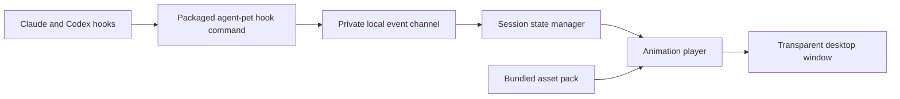

# Standalone Agent Pet plan

Updated 2026-10-04. This replaces the earlier proposal to extend the installed `vpet` command.

## Product and current state

Build an independently installable desktop companion. Users install Agent Pet, enable the Claude Code and/or Codex integration, and see the pet react to agent activity. All required artwork and runtime resources ship with the application.

Completed: copied the entire VUP character pack, preserved upstream terms and provenance, verified every copied file against its source, and added portable inventory tooling. This project directory can be moved intact into its own repository. The application is still to be built.

Initial release target: Linux desktop, with X11 and XWayland behavior tested explicitly. Keep the event protocol and asset format portable for later Windows and macOS packages. Choose the desktop shell after a small transparency, input, tray, and packaging prototype; native Wayland compatibility needs validation.

## Architecture

The app owns its window, animation player, state, settings, and launcher. Load resources relative to the installed package, with a project-relative lookup for development. The original VPet installation and checkout are not runtime dependencies. Persist preferences and state in the platform's user data directory, outside installed resources.

Provide `agent-pet hook --provider claude|codex` for agent callbacks and `agent-pet emit` for playback verification. Hook handlers parse stdin, normalize the event, send a short message, and exit successfully with no stdout. Launch the UI once through the application launcher. Hooks must return promptly even when the UI is closed.

Use a private Unix socket on Linux/macOS and a named pipe if Windows is added. Pass event/session/tool identifiers, timestamps, and classification only; prompt text and tool output are unnecessary for rendering. Keep provider parsing separate from pet behavior and animation playback.

## Assets and playback

The original bundle contains 5,498 PNGs plus ten metadata files. Keep original bytes under `assets/vpet/pet/`; the checksum manifest identifies the exact imported snapshot. The generated `assets/vpet/animations.json` preserves full sequence paths so numeric variants remain distinct.

| Display state | Candidate asset | Transition |
| --- | --- | --- |
| Starting | `StartUP` | Once → idle |
| Idle | `Default` | Loop |
| Thinking | `Think` | Start → held loop → end |
| Reading / researching | `WORK/Study`, `WORK/StudyTWO` | Start → held loop → end |
| Editing / executing | `WORK/WorkONE` | Start → held loop → end |
| Needs input | `Say/Serious` with attention badge | Held until resolved |
| Tool error | `Switch/Down` | Brief reaction → prior activity |
| Turn finished | `LevelUP/Happy` | Once → idle |
| Inactive | `Sleep` | Start → loop |
| Closing | `Shutdown` | Once |

Choose compatible start/loop/end variants explicitly. Read per-frame durations instead of assuming a fixed frame rate. Eight frames in `IDEL/Squat/C_Happy` lack timing suffixes; omit that sequence from release packs until timing is resolved. Food/gift composite sequences can remain outside the first release pack.

Decode only active/nearby frames, scale to display size, and bound the cache. The original bundle is about 735 MiB. During implementation, select the initial states, produce smaller derived resources, compare visual quality and timing, and retain notices in every resulting pack. Preserve original assets for future pack variants.

## Hook behavior

Use SessionStart for startup; UserPromptSubmit for thinking; PreToolUse for working/reading; PostToolUse to resume thinking once active tool calls finish; PermissionRequest for attention; main-session Stop for turn-finished; and SessionEnd for removing a session. `Stop` does not establish that the task succeeded or tests passed.

Claude's adapter also handles PostToolUseFailure and relevant Notification events. Codex's adapter handles structured failures from PostToolUse and Interrupt. These mappings come from the official hook references inspected on 2026-10-03: [Claude](https://code.claude.com/docs/en/hooks) and [Codex](https://learn.chatgpt.com/docs/hooks). Validate payloads and event coverage against supported client versions during implementation.

Track multiple sessions, tool call IDs, and child sessions. Ignore duplicate events, avoid stale callbacks replacing newer activity, and distinguish interrupted/stale sessions from completed ones. Give waiting-for-input sessions priority; allow users to select the displayed session. Animation changes must not affect game hunger, currency, stamina, or tool approvals.

## Packaging and installation

Bundle the desktop executable, lightweight hook entry point, asset catalog, selected artwork, notices, and all runtime dependencies required by the chosen shell. A recipient should not need Python, .NET, Node, VPet, or this repository separately to launch the release.

Provide application-owned resource resolution, a stable installed hook command, desktop launcher, icon, and version metadata. Quote installed paths correctly, including spaces. Enabling integrations should merge only this app's hook entries and preserve existing configuration. Support inspecting entries before enabling them. Uninstall removes only this app's registrations and offers to preserve user preferences.

Keep release build inputs inside this project. Do not put developer home paths into generated hook templates, resource manifests, or installers. CI should build from a clean checkout plus bundled assets. Choose an explicit license for original application code before publishing; artwork retains its separate upstream terms.

Include `THIRD_PARTY_NOTICES.md` and `licenses/VPET-ARTWORK-TERMS.md` in distributions and provide an accessible About view with source attribution. The copied notice contains additional commercial-use requirements; packaging must preserve that distinction.

## Implementation milestones

1. **Desktop prototype:** choose the shell using transparency, dragging, click-through, tray, and clean-machine packaging checks. Play bundled idle and thinking animations independently of the original installation.
2. **Animation engine:** implement precise timing, stable variant IDs, held loops, interrupt transitions, and bounded decoding. Add a developer asset preview.
3. **Event core:** implement the packaged hook command, private IPC, session state manager, and event replay. Verify closed-app behavior, duplicate events, and overlapping tools.
4. **Integrations:** implement Claude and Codex adapters and additive install/uninstall. Exercise prompts, tools, permission waits, failure, stop, interruption, and child completion in supported clients.
5. **Release:** generate a reduced asset pack, bundle runtime dependencies and notices, and produce the Linux installer/archive. Test after moving it to a path with spaces and on a machine without VPet. Verify upgrades preserve settings and uninstall preserves unrelated hooks.

The first release is complete when another user can install it and see accurate idle, thinking, working, attention, and turn-finished states from both clients using only the distributed package.
