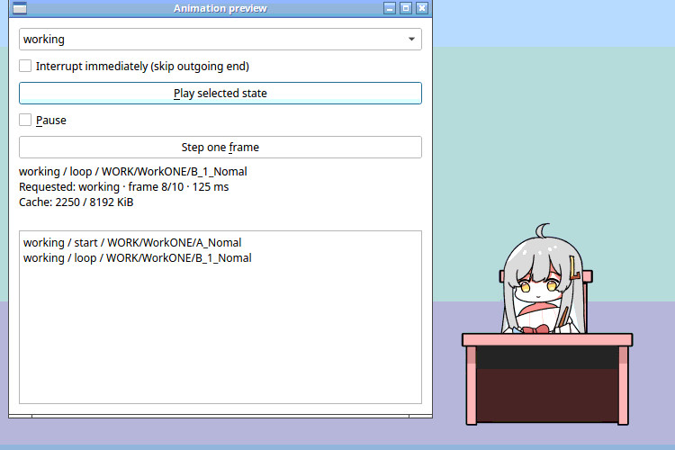
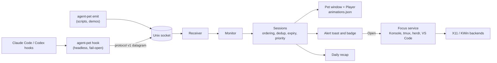

# Agent Pet

A standalone desktop companion that animates in response to Claude Code and Codex hooks.

Agent Pet runs on Linux x86_64 (X11 and XWayland) and macOS 11+ (Apple silicon and Intel). On Linux it ships as a self-contained tarball with an installer, one-click Claude Code and Codex integration, and automatic updates; on macOS as an app in a disk image (`.dmg`) or zip, with the same integration and update notifications. See the [install guide](starter/docs/install.md). The application lives in [starter/](starter/README.md). This repository root also keeps the full 749 MB VPet artwork archive as a source bundle; the app never reads it at runtime.

Application code is licensed under Apache-2.0 ([LICENSE](starter/LICENSE)); the artwork keeps its own terms.

## Features

Every image below was captured from the running app (`starter/`, Linux, X11) with demo events sent through `agent-pet emit`. Project names and session IDs are made up. See the [starter README](starter/README.md) for the full behavior of each feature.

### Reacts to what your agents are doing

Claude Code and Codex hooks report each session's activity, and the pet animates the most important state across all sessions.

<table>
  <tr>
    <td align="center"><br>Thinking</td>
    <td align="center"><br>Reading files</td>
    <td align="center"><br>Running tools</td>
    <td align="center"><br>Needs approval or input</td>
  </tr>
  <tr>
    <td align="center"><br>Tool error</td>
    <td align="center"><br>Turn finished</td>
    <td align="center"><br>Dozes off after 10 quiet minutes</td>
    <td align="center"><br>Jumps at <code>rm -rf</code> or <code>git push --force</code></td>
  </tr>
</table>

### Alerts that point to the right session

Approval and input requests and tool errors raise a one-line toast beside the pet. **Open** brings the agent's terminal or editor forward (Konsole, tmux, herdr, VS Code, or any X11 window), **×** dismisses it, and **+N** shows how many more are waiting. An orange badge stays on the pet until the waiting session moves on. Alerts can be muted, and an optional sound plays for new ones.


### Running sessions at a glance

Click the pet to list every observed session, most urgent first, with project, status, provider, short ID and host. Click a row to jump to that session.


### Drag, pet and throw it

Drag the pet anywhere; it dangles while you hold it. Hold still on its head or tummy and it reacts to being petted. Let go mid-swing and it tumbles to the bottom of the screen, then gets back up. Push it past a screen edge and it hides there, peeking out until agent activity brings it back.

<table>
  <tr>
    <td align="center"><br>Drag and throw</td>
    <td align="center"><br>Hide at the edge</td>
  </tr>
  <tr>
    <td align="center"><br>Head pat</td>
    <td align="center"><br>Tummy poke</td>
  </tr>
</table>

### Idle life: fidgets, mood and wandering

While no agent needs it, the pet fidgets now and then, alternates its idle loop and, after a few quiet minutes, walks, crawls or climbs along the screen edges. A run of finished turns makes it happy and repeated errors make it droopy; after a long productive stretch it hints that you should take a break.

<table>
  <tr>
    <td align="center"><br>Walking</td>
    <td align="center"><br>Crawling</td>
    <td align="center"><br>Climbing an edge</td>
  </tr>
  <tr>
    <td align="center"><br>Idle fidget</td>
    <td align="center"><br>Happy celebration</td>
    <td align="center"><br>Take-a-break hint</td>
  </tr>
</table>

### Easter eggs

Special days, Friday evenings, late nights, long turns and every hundredth finished turn get their own reactions. There is at least one more to find.

<table>
  <tr>
    <td align="center"><br>Friday evening dance</td>
    <td align="center"><br>Your birthday</td>
    <td align="center"><br>May 20</td>
    <td align="center"><br>Every 100th turn</td>
  </tr>
</table>

### Wellness reminders

While you work, the pet looks after you too. After 20 minutes of activity it suggests looking at something far away for 20 seconds (click the note and it counts the seconds down), and after an hour it gets thirsty and reminds you to drink some water. Reminders wait until you are at the computer, stay out of the way while an agent needs you or alerts are muted, pause while the screen is locked and skip quiet hours. Settings → **Reminders** sets both intervals or turns them off.

<table>
  <tr>
    <td align="center"><br>Eye break</td>
    <td align="center"><br>Time for water</td>
  </tr>
</table>

### Daily recap

Right-click → **Today's recap** and the pet sums up what your agents did today, such as "Today: 38 turns across 3 projects · 2 approvals waited 10+ min · longest run 22 min". Click the note for turns per project, errors, approvals with the longest wait and the longest run. On weekdays the 4:45 PM go-home reminder includes the summary. Only counts and project folder names are kept, for two weeks, never prompts, commands or paths.

<table>
  <tr>
    <td align="center"><br>Summary</td>
    <td align="center"><br>Click for the breakdown</td>
  </tr>
</table>

### Remarks

Reminders, the recap and the pet's own comments (Monday blues, time to go home, time for bed) appear in a small speech bubble that fades on its own or when clicked, so they never cover your work for long.

### Menu, settings and developer preview

Right-click the pet (or its tray icon) for everyday actions: running sessions, today's recap, mute, always on top, Settings and Quit. **More** holds the animation preview, temporary click-through, position recovery, updates and the artwork terms. Settings has three tabs: **General** (size, alerts, reminders), **Pet** (idle animation, wandering, mood, touch, easter eggs, birthday, recap) and **Startup and agents** (autostart and one-click Claude Code and Codex integration). `--preview` opens a developer window that plays any state and steps through frames.

<table>
  <tr>
    <td align="center" valign="top"><br>Right-click menu</td>
    <td align="center" valign="top"><br>Settings</td>
  </tr>
  <tr>
    <td align="center" colspan="2"><br>Animation preview</td>
  </tr>
</table>

### Install and updates

A self-contained Linux x86_64 tarball includes an interactive installer that sets up the menu entry, the `agent-pet` command, agent hooks and autostart, plus an uninstaller that removes only Agent Pet's own hook entries. Updates download only the components that changed, down to individual animation sequences, so a new or edited animation fetches just its own frames. If the new version fails to start, the previous one is restored. The macOS app is universal and signed ad hoc but not notarized, so the first launch needs approving in System Settings; it announces updates and installs them by hand. See the [install guide](starter/docs/install.md#macos).


## Architecture

Agent Pet is one C++17 / Qt 6 binary, `agent-pet`, with two roles. Inside Claude Code and Codex it runs as a tiny headless **hook**: it turns the client's hook JSON into a normalized event, sends one datagram over a private Unix socket and exits, always silently and within 150 ms, never sending prompts or tool content. On the desktop it is the **pet**: it receives those events, tracks every session, and picks what to animate and when to alert.



| Layer | What it does |
| --- | --- |
| **Providers** | Map each client's hook events onto protocol v1 and merge Agent Pet's own entries into the client config without touching anyone else's hooks |
| **Sessions** | Track concurrent sessions and tools and pick one aggregate state: attention > error > turn finished > working > reading > thinking > idle |
| **Animation** | Play the data-driven catalog in `animations.json`: phased sequences, weighted variants, mood art, fidgets, reactions, touch and moves |
| **Desktop** | The pet window, alert toast, session list, speech bubble, wandering, wellness reminders and recap |
| **Hosts** | Record where a session runs (Konsole tab, tmux or herdr pane, X11 window) and bring it forward on **Open** |
| **Platform** | Small contracts for native services, with POSIX, Linux and macOS implementations; X11 and D-Bus are linked only by the Linux `pet_native` |
| **Updates** | Verified release metadata and component downloads (app, runtime, one pack per animation sequence) with rollback |

Only preferences and the recap's daily counts are written to disk; sessions and alerts live in memory. A portable-core build (`AGENT_PET_PORTABLE_CORE=ON`) compiles the event, session, provider and focus logic with no X11, D-Bus, Widgets or libarchive, which keeps the door open for other platforms. For the details see the [architecture notes](starter/docs/architecture.md), the [event protocol](starter/docs/events.md), [integrations](starter/docs/integrations.md) and [platform services](starter/src/platform/README.md).

## Included

- **5,498 original PNG frames**, across 558 sequence folders and 25 animation categories.
- Character metadata and nine sequence metadata files: **5,508 imported files**, 735.26 MiB in total.
- A manifest with relative paths, provenance, sizes, and SHA-256 checksums.
- Upstream artwork terms, original README, and code license for provenance. The code license does not replace the artwork terms.
- A portable asset verification/catalog script and a [standalone application plan](PLAN.md).

```text
agent-pet/
├── assets/vpet/
│   ├── manifest.json
│   └── pet/
│       ├── vup.lps
│       └── vup/                 # original sprites and sequence metadata
├── docs/ASSETS.md               # generated catalog
├── licenses/
├── scripts/assets.py
├── PLAN.md
├── README.md
└── THIRD_PARTY_NOTICES.md
```

## Inspect the bundled assets

Python 3.9 or newer is sufficient for these development commands:

```bash
python3 scripts/assets.py verify
python3 scripts/assets.py catalog
```

The commands locate the project from the script's location, so they also work when invoked from a different working directory. `verify` checks every imported file, rejects symlinks, and checks for unlisted asset files. `catalog` lists every sequence and preserves upstream folder names and filename timing.

No sprite conversion has been applied. Eight frames in `IDEL/Squat/C_Happy` lack duration suffixes; the catalog flags them so playback can exclude that sequence until timing is resolved.

## Distribution

The release plan bundles the renderer, hook command, selected animation resources, and required notices into an installable application. Users should not need this source checkout, Python, VPet, or a separately installed runtime to run the release.

Keep the original artwork as the source bundle; choose and optimize a smaller release pack during implementation. See [the packaging plan](PLAN.md) and [third-party notices](THIRD_PARTY_NOTICES.md).
