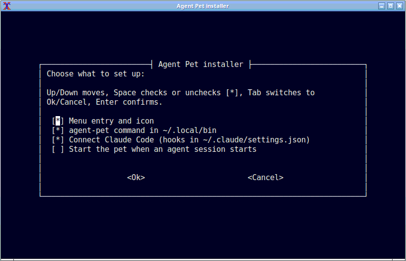
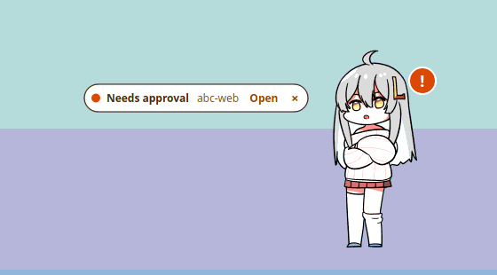
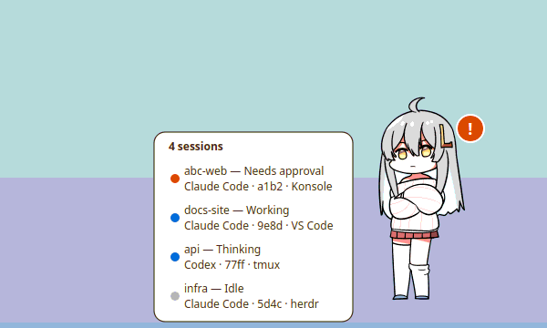
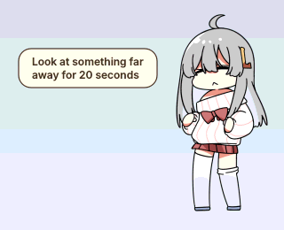
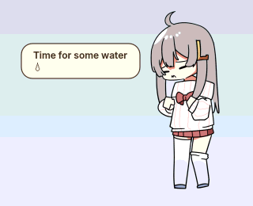
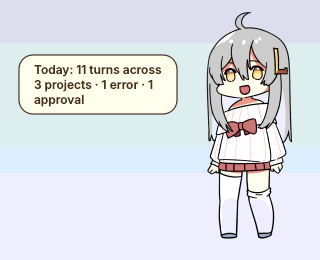
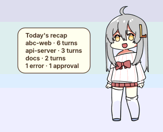
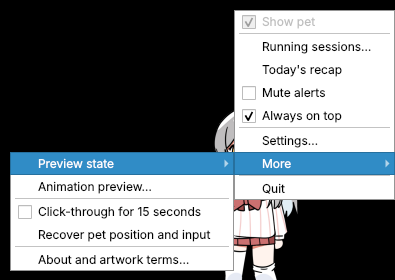
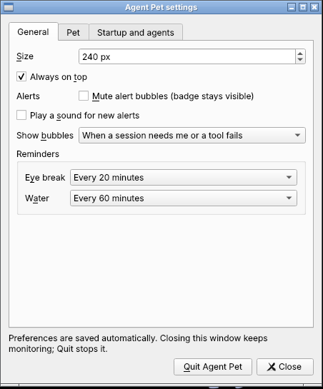

# Agent Pet

**A little desktop pet that keeps you company while Claude Code and Codex work.**

It sits on your screen, thinks when your agent thinks, gets busy when it runs tools, and waves at you when a session needs your approval, so you can look away from the terminal without missing anything.

  
  
  
  

- **Know at a glance** what every agent session is doing.
- **Never miss a request**: a small note pops up when an agent waits for you, and one click takes you to the right terminal.
- **A pet, not just a status light**: drag it, pet it, throw it, watch it wander and nap.
- **Looks after you**: gentle reminders to rest your eyes and drink water, and a recap of your day.
- **Private**: it only learns *what kind* of thing is happening, never your prompts, code or commands.

Works on **Linux** x86_64 (X11, or Wayland desktops with XWayland such as GNOME and KDE) and **macOS 11+** (Apple silicon and Intel).

## Get started

Download the latest version from the [Releases page](https://github.com/WindyWin/vpet-agent-pet/releases).

**Linux**

1. Download `agent-pet-<version>-linux-x86_64.tar.gz` and extract it.
2. In the extracted folder, run `./install.sh`. It asks a few simple questions: where to install, whether to add a menu entry and connect Claude Code and/or Codex, and whether the pet should start on its own when an agent session starts.
3. Restart Claude Code or Codex and send a prompt. The pet reacts.

**macOS**

1. Download the `.dmg`, open it and drag **Agent Pet** into **Applications**.
2. Open it. The first time, macOS asks you to confirm: go to **System Settings → Privacy & Security → Open Anyway** (on macOS 14 or older, Control-click the app → **Open**).
3. Right-click the pet → **Settings → Startup and agents**, press **Enable** next to Claude Code or Codex, then restart the client.

Need more detail, or something isn't working? See the [install guide](starter/docs/install.md) and its [troubleshooting table](starter/docs/install.md#troubleshooting).

## What it does

*All pictures are from the real app; project names are made up.*

### Shows what your agents are up to

Run as many sessions as you like. The pet always shows the one that matters most right now: a request waiting for you beats an error, which beats a finished turn, and so on.

<table>
  <tr>
    <td align="center"> Thinking</td>
    <td align="center"> Reading files</td>
    <td align="center"> Working</td>
    <td align="center"> Waiting for you</td>
  </tr>
  <tr>
    <td align="center"> Something failed</td>
    <td align="center"> Done!</td>
    <td align="center"> Naps after 10 quiet minutes</td>
    <td align="center"> Jumps at risky commands like <code>rm -rf</code></td>
  </tr>
</table>

It doesn't just loop one pose while it works, either. It swaps its book for a pen without leaving the desk, twirls the pen, and every so often does something new. In Settings you can make it calmer (**Subtle**) or keep the classic single loop (**Classic**); the lively style (**Playful**) is the default.

<table>
  <tr>
    <td align="center"> From reading to writing</td>
    <td align="center"> Twirling the pen</td>
  </tr>
</table>

### Tells you when an agent needs you

When an agent asks for approval or input, or a tool fails, a short note appears beside the pet. Click **Open** to jump straight to that agent's terminal or editor, or **×** to dismiss it. An orange badge stays on the pet until you've answered. You can mute the notes, or turn on a sound for new ones.

### All your sessions in one list

Click the pet to see every running session, most urgent first. Click one to jump to it.

### Play with it

Drag it anywhere and it dangles from your cursor. Hold still on its head or tummy and it enjoys being petted. Let go mid-swing and it tumbles down, then gets back up. Push it past the side of the screen and it hides there, peeking out until your agents get busy again.

Just don't overdo it: throw it around too much, pet it nonstop or hold on to it too long, and it gets grumpy and leaves.

<table>
  <tr>
    <td align="center"> Drag and throw</td>
    <td align="center"> Hide at the edge</td>
  </tr>
  <tr>
    <td align="center"> Head pat</td>
    <td align="center"> Tummy poke</td>
  </tr>
  <tr>
    <td align="center" colspan="2"> Too much petting: it storms off</td>
  </tr>
</table>

### A life of its own

When nothing needs it, the pet yawns, looks around and every so often goes for a walk, crawls along the screen or climbs up its edge. It also has moods: a good run of finished work makes it happy, lots of errors make it droopy, and after a long busy stretch it gets hungry, a hint that you could use a break too.

<table>
  <tr>
    <td align="center"> Walking</td>
    <td align="center"> Crawling</td>
    <td align="center"> Climbing</td>
  </tr>
  <tr>
    <td align="center"> Idle fidget</td>
    <td align="center"> Happy</td>
    <td align="center"> Time for a break?</td>
  </tr>
</table>

### Little surprises

Friday evenings, your birthday, late nights, very long tasks and every 100th finished task get their own reactions. On weekdays it reminds you to get ready to go home, and at night it tells you to go to bed. There's at least one more surprise to find.

<table>
  <tr>
    <td align="center"> Friday evening dance</td>
    <td align="center"> Your birthday</td>
    <td align="center"> May 20</td>
    <td align="center"> Every 100th task</td>
  </tr>
</table>

### Takes care of you

Every 20 minutes of work it reminds you to look at something far away for 20 seconds (click the note and it counts down with you), and every hour it reminds you to drink some water. It waits until you're actually at the computer, stays quiet while an agent needs you, and leaves you alone at night.

<table>
  <tr>
    <td align="center"> Eye break</td>
    <td align="center"> Time for water</td>
  </tr>
</table>

### Sums up your day

Right-click → **Today's recap** for a one-line summary like *"Today: 38 turns across 3 projects · longest run 22 min"*. Click it for a per-project breakdown. On weekdays the go-home reminder includes it too.

<table>
  <tr>
    <td align="center"> Summary</td>
    <td align="center"> Breakdown</td>
  </tr>
</table>

### Make it yours

Right-click the pet (or its tray / menu bar icon) for everything: your sessions, today's recap, mute, always on top, Settings and Quit. In **Settings** you can:

- change its size and choose which notes pop up;
- make it calmer or livelier (when idle and while working), and switch off wandering, moods, touch or surprises;
- set or turn off the eye and water reminders, and enter your birthday;
- connect Claude Code and Codex with one click, and have it start with your agents or at login;
- choose how updates are installed.

If it ever gets in the way, click the tray icon to hide it. It keeps watching your sessions and shows a badge on the icon instead.

<table>
  <tr>
    <td align="center" valign="top"> Right-click menu</td>
    <td align="center" valign="top"> Settings</td>
  </tr>
</table>

### Stays up to date

On Linux the pet updates itself in the background by default, downloading only what changed and keeping your settings. If a new version fails to start, it goes back to the previous one. On macOS it tells you when a new version is out, and you install it by replacing the app.

## Your privacy

- Everything stays on your computer. The pet only hears from your agents through a private local channel.
- It learns *what kind* of thing is happening (thinking, working, waiting, finished), never your prompts, code, file contents or commands. For risky commands it gets only a simple "this looks dangerous" yes or no.
- The only things it saves are your settings and the recap's daily counts (with project folder names), kept for two weeks.
- Connecting it adds its own small entries to Claude Code's or Codex's hook settings and leaves everything else there untouched. Uninstalling removes only those entries.

## Good to know

- **Not reacting?** Restart Claude Code or Codex after connecting, then send a new prompt. In Codex, approve the new hooks in `/hooks`.
- **Lost the pet?** Click the tray icon, or right-click it → **More → Recover pet position and input**.
- **macOS:** jumping to a terminal window and automatic updates aren't available yet. **Open** still switches tmux and herdr panes.
- **Linux on Wayland:** the pet runs through XWayland, which GNOME and KDE provide by default. Pure Wayland isn't supported yet.

## Issues and discussion

Open an issue from the [template chooser](https://github.com/WindyWin/vpet-agent-pet/issues/new/choose): **Bug report** for a problem, **Feature request** for an improvement, or **Discussion topic** for a question or idea. Search existing issues first and keep each issue focused on one topic. The forms guide you through the relevant context; bug reports ask for your version, environment and steps to reproduce.

## For developers

The app lives in [`starter/`](starter/README.md): building from source, running tests, command-line options, sending demo events and packaging. Further reading:

- [Architecture overview](starter/docs/architecture.md) and [design decision records](starter/docs/adr/README.md)
- [Event protocol](starter/docs/events.md) and [Claude Code / Codex integrations](starter/docs/integrations.md)

This repository root also keeps the original VPet artwork archive (about 5,500 frames, 735 MiB) as a source bundle for adding new animations. The app itself doesn't need it. Check it with `python3 scripts/assets.py verify`, or list every sequence with `python3 scripts/assets.py catalog`.

## Credits and license

Character artwork by the **VUP-Simulator team**, from [LorisYounger/VPet](https://github.com/LorisYounger/VPet). The artwork keeps its own [terms](licenses/VPET-ARTWORK-TERMS.md); see [third-party notices](THIRD_PARTY_NOTICES.md).

Agent Pet's own code is licensed under [Apache-2.0](starter/LICENSE). That license doesn't cover the artwork.
