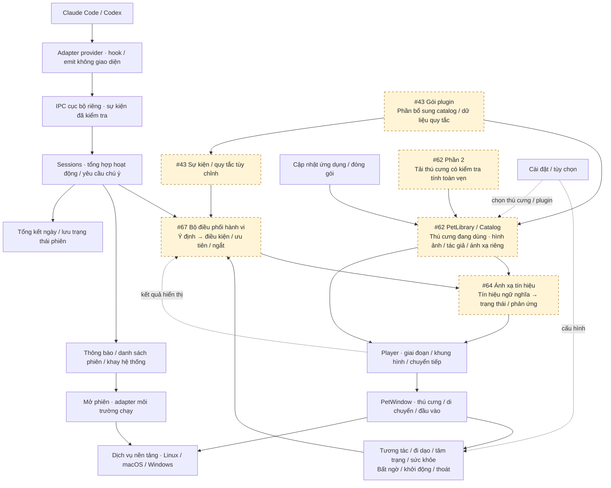
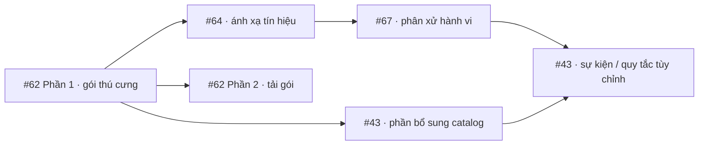

# Agent Pet

[English](README.md) | **Tiếng Việt**

**Một thú cưng nhỏ trên màn hình, đồng hành cùng bạn khi Claude Code và Codex làm việc.**

Thú cưng nằm ngay trên màn hình: suy nghĩ khi agent suy nghĩ, bận rộn khi agent chạy công cụ và vẫy tay khi phiên làm việc cần bạn phê duyệt. Bạn có thể rời mắt khỏi terminal mà vẫn biết lúc nào cần quay lại.

  
  
  
  

- **Nắm trạng thái ngay khi nhìn**: biết các phiên agent đang làm gì.
- **Không bỏ lỡ yêu cầu**: thông báo nhỏ xuất hiện khi agent chờ bạn; một cú nhấp đưa bạn đến đúng terminal.
- **Một thú cưng để tương tác**: kéo, vuốt ve, tung lên, ngắm nó đi dạo và ngủ.
- **Nhắc bạn chăm sóc bản thân**: nghỉ mắt, uống nước và xem lại hoạt động trong ngày.
- **Riêng tư**: chỉ nhận biết *loại hoạt động*, không đọc prompt, mã nguồn hay câu lệnh của bạn.

Hỗ trợ **Linux** x86_64 (X11 hoặc desktop Wayland có XWayland như GNOME và KDE), **macOS 11+** (Apple silicon và Intel), và **Windows 10 phiên bản 1809 trở lên / Windows 11** (x64).

## Bắt đầu

Tải phiên bản mới nhất từ [trang Releases](https://github.com/WindyWin/vpet-agent-pet/releases).

**Linux**

1. Tải `agent-pet-<version>-linux-x86_64.tar.gz` và giải nén.
2. Trong thư mục vừa giải nén, chạy `./install.sh`. Trình cài đặt hỏi nơi cài, có thêm mục trong menu ứng dụng và kết nối Claude Code hoặc Codex hay không, cùng tùy chọn tự khởi động thú cưng khi phiên agent bắt đầu.
3. Khởi động lại Claude Code hoặc Codex và gửi một prompt. Thú cưng sẽ phản ứng.

**macOS**

1. Tải tệp `.dmg`, mở và kéo **Agent Pet** vào **Applications**.
2. Mở ứng dụng. Lần đầu, macOS yêu cầu xác nhận: vào **System Settings → Privacy & Security → Open Anyway** (trên macOS 14 trở xuống, giữ Control rồi nhấp ứng dụng → **Open**).
3. Nhấp chuột phải vào thú cưng → **Settings → Startup and agents**, bấm **Enable** cạnh Claude Code hoặc Codex, rồi khởi động lại client.

**Windows**

1. Tải và chạy `agent-pet-<version>-windows-x86_64-setup.exe`. Bộ cài cài cho người dùng hiện tại, không cần quyền quản trị, và thêm **Agent Pet** vào Start menu. Qt, Visual C++ runtime và hình ảnh thú cưng đã được đóng gói sẵn.
2. Trong bộ cài, chọn kết nối Claude Code hoặc Codex và tự khởi động thú cưng khi đăng nhập Windows hoặc khi phiên agent bắt đầu. Bạn cũng có thể kết nối sau tại **Settings → Startup and agents**.
3. Khởi động lại Claude Code hoặc Codex và gửi một prompt. Hook của Claude Code cần phiên bản **2.1.139 trở lên**; với Codex, xác nhận tin cậy hook trong `/hooks`.

Bản Windows chưa được ký mã. Nếu SmartScreen cảnh báo, chọn **More info → Run anyway**. Để dùng bản portable, giải nén `agent-pet-<version>-windows-x86_64.zip` vào thư mục có đường dẫn không chứa dấu cách, rồi chạy `agent-pet.exe`. Xem [hướng dẫn cài Windows](starter/docs/install.md#windows) để biết chi tiết.

Cần hướng dẫn kỹ hơn hoặc gặp vấn đề? Xem [hướng dẫn cài đặt](starter/docs/install.md) và [bảng xử lý sự cố](starter/docs/install.md#troubleshooting) (tiếng Anh).

## Các tính năng

*Tất cả hình ảnh đều chụp từ ứng dụng thật; tên dự án chỉ là ví dụ.*

### Hiển thị hoạt động của agent

Bạn có thể chạy nhiều phiên cùng lúc. Thú cưng luôn hiển thị phiên cần chú ý nhất: yêu cầu đang chờ bạn được ưu tiên hơn lỗi, lỗi được ưu tiên hơn lượt vừa hoàn thành, v.v.

<table>
  <tr>
    <td align="center"> Đang suy nghĩ</td>
    <td align="center"> Đang đọc tệp</td>
    <td align="center"> Đang làm việc</td>
    <td align="center"> Đang chờ bạn</td>
  </tr>
  <tr>
    <td align="center"> Có thao tác thất bại</td>
    <td align="center"> Xong rồi!</td>
    <td align="center"> Ngủ sau 10 phút yên tĩnh</td>
    <td align="center"> Giật mình trước lệnh nguy hiểm như <code>rm -rf</code></td>
  </tr>
</table>

Khi làm việc, thú cưng cũng thay đổi động tác: đổi sách lấy bút ngay tại bàn, xoay bút và thỉnh thoảng làm điều mới. Trong Settings, bạn có thể chọn kiểu nhẹ nhàng hơn (**Subtle**) hoặc một vòng lặp cố định (**Classic**); kiểu sinh động (**Playful**) là mặc định.

<table>
  <tr>
    <td align="center"> Từ đọc sang viết</td>
    <td align="center"> Xoay bút</td>
  </tr>
</table>

### Báo khi agent cần bạn

Khi agent cần phê duyệt, cần bạn nhập thông tin hoặc gặp lỗi công cụ, một thông báo ngắn xuất hiện cạnh thú cưng. Bấm **Open** để đến terminal hoặc trình soạn thảo của phiên đó, hoặc **×** để đóng thông báo. Dấu hiệu màu cam vẫn ở trên thú cưng cho đến khi bạn phản hồi. Bạn có thể tắt thông báo hoặc bật âm thanh khi có thông báo mới.

### Tất cả phiên trong một danh sách

Nhấp vào thú cưng để xem các phiên đang chạy, sắp xếp theo mức độ cần chú ý. Nhấp vào một phiên để chuyển đến phiên đó.

### Chơi cùng thú cưng

Kéo thú cưng đến bất kỳ đâu, nó sẽ đung đưa theo con trỏ. Giữ con trỏ trên đầu hoặc bụng để vuốt ve. Thả giữa lúc đang đung đưa, nó sẽ ngã xuống rồi đứng dậy. Đẩy ra mép màn hình, nó sẽ trốn ở đó và ló đầu ra cho đến khi agent bận rộn trở lại.

Nhưng đừng quá tay: tung quá nhiều, vuốt ve liên tục hoặc giữ quá lâu sẽ khiến nó giận và bỏ đi.

<table>
  <tr>
    <td align="center"> Kéo và tung</td>
    <td align="center"> Trốn ở mép màn hình</td>
  </tr>
  <tr>
    <td align="center"> Xoa đầu</td>
    <td align="center"> Chạm bụng</td>
  </tr>
  <tr>
    <td align="center" colspan="2"> Vuốt ve quá nhiều: giận rồi bỏ đi</td>
  </tr>
</table>

### Có nhịp sống riêng

Khi không có việc cần chú ý, thú cưng ngáp, nhìn quanh, thỉnh thoảng đi dạo, bò trên màn hình hoặc leo mép màn hình. Nó cũng có tâm trạng: nhiều lượt hoàn thành khiến nó vui, nhiều lỗi khiến nó buồn, còn làm việc liên tục quá lâu khiến nó đói — cũng là lời nhắc bạn nên nghỉ một chút.

<table>
  <tr>
    <td align="center"> Đi bộ</td>
    <td align="center"> Bò</td>
    <td align="center"> Leo</td>
  </tr>
  <tr>
    <td align="center"> Động tác khi rảnh</td>
    <td align="center"> Vui vẻ</td>
    <td align="center"> Đến lúc nghỉ rồi?</td>
  </tr>
</table>

### Những bất ngờ nhỏ

Tối thứ Sáu, sinh nhật bạn, đêm khuya, công việc kéo dài và mỗi lượt hoàn thành thứ 100 đều có phản ứng riêng. Ngày thường, thú cưng nhắc bạn chuẩn bị về nhà; ban đêm, nó nhắc bạn đi ngủ. Vẫn còn ít nhất một bất ngờ khác để bạn khám phá.

<table>
  <tr>
    <td align="center"> Điệu nhảy tối thứ Sáu</td>
    <td align="center"> Sinh nhật bạn</td>
    <td align="center"> Ngày 20 tháng 5</td>
    <td align="center"> Mỗi lượt thứ 100</td>
  </tr>
</table>

### Nhắc bạn chăm sóc bản thân

Cứ 20 phút làm việc, thú cưng nhắc bạn nhìn xa trong 20 giây (nhấp thông báo để cùng đếm ngược); mỗi giờ, nó nhắc bạn uống nước. Nó chờ đến khi bạn thực sự ở máy tính, giữ yên lặng khi agent cần bạn và không làm phiền vào ban đêm.

<table>
  <tr>
    <td align="center"> Nghỉ mắt</td>
    <td align="center"> Đến giờ uống nước</td>
  </tr>
</table>

### Tổng kết ngày làm việc

Nhấp chuột phải → **Today's recap** để xem tóm tắt một dòng, ví dụ *“Hôm nay: 38 lượt trên 3 dự án · chuỗi làm việc dài nhất 22 phút”*. Nhấp vào đó để xem chi tiết từng dự án. Lời nhắc về nhà vào ngày thường cũng kèm tổng kết này.

<table>
  <tr>
    <td align="center"> Tóm tắt</td>
    <td align="center"> Chi tiết</td>
  </tr>
</table>

### Tùy chỉnh theo ý bạn

Nhấp chuột phải vào thú cưng (hoặc biểu tượng ở khay hệ thống / thanh menu) để mở danh sách phiên, tổng kết ngày, tắt tiếng, luôn ở trên cùng, Settings và Quit. Trong **Settings**, bạn có thể:

- đổi kích thước và chọn những thông báo được hiển thị;
- chọn mức độ sinh động khi rảnh và khi làm việc, hoặc tắt đi dạo, tâm trạng, tương tác và bất ngờ;
- chỉnh hoặc tắt lời nhắc nghỉ mắt, uống nước và nhập ngày sinh nhật;
- kết nối Claude Code và Codex bằng một cú nhấp, tự khởi động cùng agent hoặc khi đăng nhập;
- chọn cách cài đặt bản cập nhật.

Giao diện hỗ trợ **tiếng Anh và tiếng Việt**. Mặc định, ứng dụng dùng ngôn ngữ hệ thống; vào **Settings → General → Language** để chuyển ngay.

Nếu thú cưng che mất nội dung, nhấp biểu tượng ở khay hệ thống để ẩn nó. Nó vẫn theo dõi các phiên và hiển thị dấu hiệu cần chú ý trên biểu tượng.

<table>
  <tr>
    <td align="center" valign="top"> Menu chuột phải</td>
    <td align="center" valign="top"> Cài đặt</td>
  </tr>
</table>

### Cập nhật phiên bản

Trên Linux, mặc định thú cưng tự cập nhật nền, chỉ tải phần đã thay đổi và giữ nguyên cài đặt. Nếu bản mới không khởi động được, ứng dụng quay lại bản trước. Trên macOS và Windows, thú cưng thông báo khi có phiên bản mới: thay ứng dụng trên macOS hoặc chạy bộ cài Windows mới hơn. Cài đặt và hook đã bật được giữ lại khi nâng cấp tại cùng vị trí.

## Quyền riêng tư

- Mọi dữ liệu hoạt động ở trên máy bạn. Thú cưng chỉ nhận sự kiện từ agent qua một kênh cục bộ riêng.
- Nó chỉ biết *loại hoạt động* (suy nghĩ, làm việc, chờ, hoàn thành), không nhận prompt, mã nguồn, nội dung tệp hay câu lệnh. Với lệnh nguy hiểm, nó chỉ nhận một giá trị có/không cho biết “lệnh này có vẻ nguy hiểm”.
- Dữ liệu lưu lại chỉ gồm cài đặt và số liệu tổng kết mỗi ngày (có tên thư mục dự án), giữ trong hai tuần.
- Khi kết nối, ứng dụng thêm các mục hook riêng vào cài đặt Claude Code hoặc Codex và giữ nguyên các mục khác. Gỡ cài đặt chỉ xóa những mục của Agent Pet.

## Lưu ý khi sử dụng

- **Thú cưng không phản ứng?** Khởi động lại Claude Code hoặc Codex sau khi kết nối, rồi gửi prompt mới. Trong Codex, phê duyệt hook mới tại `/hooks`.
- **Không thấy thú cưng?** Nhấp biểu tượng ở khay hệ thống, hoặc nhấp chuột phải → **More → Recover pet position and input**.
- **macOS:** chưa hỗ trợ đưa cửa sổ terminal lên trước và tự động cài cập nhật. **Open** vẫn chuyển được pane tmux và herdr.
- **Windows:** **Open** đưa cửa sổ Windows Terminal hoặc console cổ điển của agent lên trước; nếu không tìm được, ứng dụng tìm trình soạn thảo hoặc terminal theo cây tiến trình cha. Chưa hỗ trợ tự động cài cập nhật; hãy chạy bộ cài mới hơn. Dùng `agent-pet-cli.exe` cho lệnh hook và thao tác cần xuất kết quả ra console.
- **Linux trên Wayland:** thú cưng chạy qua XWayland, có sẵn mặc định trên GNOME và KDE. Chưa hỗ trợ Wayland thuần.

## Dành cho lập trình viên

### Tổng quan kiến trúc

Kiến trúc mục tiêu từ đầu vào đến hiển thị. **Các ô nét đứt là phần dự kiến**; những phần còn lại đã có. Cho đến khi #64 và #67 hoàn thành, `Monitor`, `PetWindow` và các mô-đun hành vi cùng đảm nhiệm việc chọn tín hiệu và phân xử. Mũi tên thể hiện luồng chạy, không phải thứ tự build.

`Sessions` quyết định ưu tiên giữa các phiên; #67 chọn giữa các ý định hành vi; #64 quyết định cách thú cưng thể hiện tín hiệu được chọn. Thông báo có luồng phân phối riêng. Di chuyển và thao tác cửa sổ gốc vẫn ở `PetWindow` và các dịch vụ nền tảng. Xem [bản đồ mã nguồn](starter/docs/architecture.md#code-map) để tìm đường dẫn và các quyết định thiết kế.

### Lộ trình theo kiến trúc

Các công việc còn mở, đã đối chiếu với GitHub ngày 2026-10-07. Mỗi issue chứa danh sách tiêu chí nghiệm thu chi tiết; đánh dấu hàng tương ứng khi giai đoạn hoàn thành và cập nhật sơ đồ khi một lớp dự kiến đã được triển khai.

| Hoàn thành | Phần kiến trúc | Công việc / issue | Phụ thuộc |
| --- | --- | --- | --- |
| ☐ | PetLibrary / Catalog | [#62 Phần 1 — chọn gói thú cưng](https://github.com/WindyWin/vpet-agent-pet/issues/62) | Nền tảng độc lập |
| ☐ | Ánh xạ tín hiệu | [#64 — tín hiệu ngữ nghĩa và ánh xạ riêng cho từng thú cưng](https://github.com/WindyWin/vpet-agent-pet/issues/64) | #62 Phần 1 |
| ☐ | Bộ điều phối hành vi | [#67 — phân xử ý định và vòng đời](https://github.com/WindyWin/vpet-agent-pet/issues/67) | #64 |
| ☐ | Catalog plugin | [#43 Giai đoạn 1 — phần bổ sung catalog và cài đặt plugin](https://github.com/WindyWin/vpet-agent-pet/issues/43) | #62 Phần 1 |
| ☐ | Quy tắc plugin → bộ điều phối | [#43 Giai đoạn 2–3 — sự kiện tùy chỉnh và điều kiện kích hoạt từ dữ liệu](https://github.com/WindyWin/vpet-agent-pet/issues/43) | Phần bổ sung catalog, #64 và #67 |
| ☐ | Phân phối thú cưng | [#62 Phần 2 — tải theo yêu cầu có kiểm tra tính toàn vẹn](https://github.com/WindyWin/vpet-agent-pet/issues/62) | #62 Phần 1 |
| ☐ | Adapter provider | [#36 — client agent thứ ba](https://github.com/WindyWin/vpet-agent-pet/issues/36) | Hợp đồng sự kiện hiện có |
| ☐ | Thông báo / cài đặt | [#34 — tạm hoãn / chế độ tập trung](https://github.com/WindyWin/vpet-agent-pet/issues/34) | Luồng thông báo hiện có |
| ☐ | Thông báo / yêu cầu chú ý | [#35 — tăng mức nhắc phê duyệt](https://github.com/WindyWin/vpet-agent-pet/issues/35) | Theo dõi yêu cầu chú ý hiện có |
| ☐ | Tâm trạng / tương tác | [#37 — kiếm phần thưởng để cho thú cưng ăn](https://github.com/WindyWin/vpet-agent-pet/issues/37) | Bộ đếm tâm trạng hiện có; phối hợp phản ứng với #67 |

### Hướng dẫn build và đóng góp

Mã ứng dụng nằm trong [`starter/`](starter/README.md): hướng dẫn build từ mã nguồn, chạy kiểm thử, tùy chọn dòng lệnh, gửi sự kiện demo và đóng gói. Tài liệu đọc thêm (tiếng Anh):

- [Tổng quan kiến trúc](starter/docs/architecture.md) và [các quyết định thiết kế](starter/docs/adr/README.md)
- [Giao thức sự kiện](starter/docs/events.md) và [tích hợp Claude Code / Codex](starter/docs/integrations.md)
- [Quy tắc commit cho CI](starter/README.md#ci-commit-rules): dùng `docs: ...` hoặc `docs(scope): ...` khi toàn bộ thay đổi chỉ là tài liệu. Commit cuối được push lên `main` có tiền tố `docs` sẽ bỏ qua các job build/test/package; GitHub vẫn có thể hiển thị workflow với các job bị bỏ qua. Tag phiên bản và chạy workflow thủ công vẫn build.

Thư mục gốc còn giữ bộ hình ảnh VPet nguyên bản (khoảng 5.500 khung hình, 735 MiB), làm nguồn bổ sung hoạt ảnh. Ứng dụng không cần bộ này để chạy. Kiểm tra bằng `python3 scripts/assets.py verify`, hoặc liệt kê các chuỗi bằng `python3 scripts/assets.py catalog`.

## Ghi nhận tác giả và giấy phép

Hình ảnh nhân vật do **đội ngũ VUP-Simulator** thực hiện, từ [LorisYounger/VPet](https://github.com/LorisYounger/VPet). Hình ảnh giữ [điều khoản riêng](licenses/VPET-ARTWORK-TERMS.md); xem [thông báo về bên thứ ba](THIRD_PARTY_NOTICES.md).

Mã nguồn riêng của Agent Pet được cấp phép theo [Apache-2.0](starter/LICENSE). Giấy phép đó không áp dụng cho hình ảnh nhân vật.
