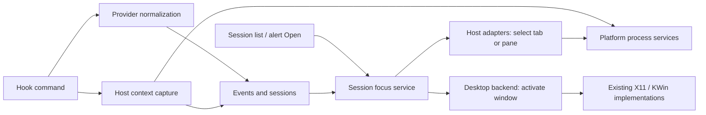

# Platform and session focus refactor plan

Status, 2026-10-06: steps 1–5 are implemented. See
[session focus](architecture.md#session-focus) for steps 1–3 and
[platform services and build registration](../src/platform/README.md) for steps
4–5. The portable-core profile excludes native services and the application.
The refactor does not expand the supported platforms.

Prepare extension points for other operating systems, Linux desktop environments,
and applications hosting agent sessions. Move the existing implementations behind
those boundaries. Keep the current Linux behavior, release format, CLI, and event
protocol throughout this refactor.

Windows, macOS, additional compositors, and new application integrations are future
work. “Plug in” means adding a compiled adapter and registering it; a dynamic
plugin loader, binary ABI, and external plugin SDK are unnecessary for this scope.

## Original coupling (before extraction)

| Location | Responsibility to separate |
| --- | --- |
| `src/desktop/host_focus.cpp` | Focus coordination, X11 operations, KWin scripting/D-Bus, Konsole tab selection, multiplexer commands, and Linux process inspection |
| `src/providers/host.cpp` | Host detection, target codecs, command construction, `/proc` ancestry, window matching, and display labels |
| `src/desktop/drag_monitor.*` | X11 connection and native pointer/window queries; the header exposes an Xlib type |
| `src/sessions/state.cpp` | Event parsing contains a fixed list of host application names |
| `src/desktop/monitor.cpp` | Consumes boolean focus results and embeds KDE-specific failure guidance |
| `src/ipc/local.cpp` | Event command orchestration, POSIX stdin reads, Unix datagrams, private runtime directory, and instance lock |
| `src/ipc/autostart.cpp` | Startup policy, Linux process launch, display detection, and XDG login entries |
| `src/providers/integrations.cpp` | Provider configuration merging mixed with POSIX shell command quoting and ownership recognition |
| `src/main.cpp` | Selects `xcb` from `DISPLAY` before creating the application |
| `src/updates/*` | Shared update logic mixed with Linux asset names, install layout, process checks, and executable paths |
| `CMakeLists.txt`, `scripts/package.py`, `packaging/` | Unconditional X11/D-Bus dependencies and Linux deployment assumptions |

Qt already supplies useful portable APIs for rendering, settings paths, files,
timers, and network access. Keep using them directly where sufficient; introduce
interfaces around actual native dependencies rather than wrapping all Qt APIs.

## Boundaries

Separate three independent concerns:

1. **Agent provider:** Claude/Codex payloads become normalized session events.
2. **Host application:** identify and select the existing terminal/editor session.
3. **Platform/desktop:** inspect processes and activate or query native windows.

A Linux distribution is not the right unit for window focus. Select compiled
backends by runtime capability and desktop protocol. Distribution-specific work
generally belongs in dependencies, packaging, or installation. An application
adapter may use different native services on different operating systems.



Organization guiding extraction (actual files and targets are listed in the platform README):

```text
src/
  sessions/                 # session/alert state; host metadata is passive data
  providers/                # agent payloads and integration configuration
  hosts/
    context.*               # neutral host descriptor and v1 metadata conversion
    registry.*              # explicit built-in registration and detection order
    focus_service.*         # selection, activation, results, active-host policy
    adapters/               # existing Konsole, tmux, herdr, VS Code, terminal
  platform/
    contracts/              # small interfaces used by actual consumers
    linux/                  # process inspection, IPC, launch, XDG, update layout
    desktop/
      x11/                  # window enumeration/activation and pointer queries
      kwin/                 # existing KWin activation path
    unsupported/            # explicit unavailable results, primarily for tests
  desktop/                  # Qt presentation and interactions
  ipc/                      # hook/emit orchestration and normalized event delivery
  updates/                  # shared release verification and update coordination
```

Construct services in the application composition code and inject only the
interfaces each consumer needs. Avoid a global service locator or a single large
`Platform` class. Keep headless capture and hook commands independent of Widgets,
X11, and GUI initialization; application activation can live in a separate target.

## Session focus contracts

The user action means “return to the application hosting this existing session.”
It does not create a terminal, launch another editor, or resume an agent process.

Use a neutral `HostContext` internally with an adapter ID, process hints, an
optional backend-qualified window reference, and adapter-owned target data.
Represent native window identity as an opaque value paired with its backend ID;
do not require every future backend to use an X11 numeric window ID. Keep native
handles and D-Bus types out of shared headers.

| Contract | Responsibility |
| --- | --- |
| Host capture/codec | Detect a host from supplied environment and process hints; validate and decode its target; provide its display label |
| Host activation adapter | Select the known tab/pane where supported and resolve the currently attached client/window hints |
| Desktop activation | Activate using backend-owned window references or process hints; report available capabilities and the result |
| Active-host query | Report active/inactive/unknown and whether that applies to a window or an exact tab/pane |
| Process services | Provide ancestry and the limited client inspection needed by existing tmux/herdr logic |
| Session focus service | Coordinate those operations and present one result to the UI |

Keep capture and activation separately linkable even when they belong to the same
adapter. Konsole activation can depend privately on D-Bus while its environment
capture remains headless.

Focus flow:

1. Copy the session identity and current host context at the click, as the existing
   KWin implementation already does to tolerate event processing during activation.
2. Resolve the adapter and validate its target before any side effect.
3. Select the adapter's tab/pane and refresh client hints where needed. Detached
   multiplexers must resolve their attached client rather than focus their server.
4. Ask the applicable desktop backend to raise the host window, retaining the
   existing X11-then-KWin fallback where it is currently used.
5. Return selection and activation outcomes separately, then apply the existing
   alert dismissal policy in the UI.

Use structured results instead of one boolean: `Unsupported`, `MissingTarget`,
`TargetNotFound`, `Failed`, `TimedOut`, `Requested`, and `Confirmed`, with separate
selection and activation fields. A successful X11 request is `Requested`; the
current KWin callback can report `Confirmed`. Selecting a tab alone does not mean
the application was raised. Preserve the current boolean-to-dismissal behavior
through an explicit compatibility mapping during extraction; do not silently
change it while moving code.

Preserve adapter-specific behavior too: Konsole currently attempts window focus
even if tab selection fails, whereas a failed tmux/herdr selection command stops
the ordinary focus path. Keep these policies explicit and covered by tests.

Retain bounded operations and the existing command timeouts. Native implementations
own their execution details. A fully asynchronous focus pipeline is a separate
improvement; it is not required to extract these boundaries.

For automatic alert suppression, preserve current behavior: an active X11 host
window is the existing signal for ordinary hosts, while tmux/herdr remain excluded.
Represent unavailable observation as `Unknown`, never evidence that a session is
active. Exact editor-terminal or multiplexer-pane visibility is a future capability.

Keep current window matching and detection precedence during extraction. In
particular, capture currently prefers herdr, then tmux, then Konsole, then VS Code,
then generic terminal. Multi-window ambiguity improvements and richer nested-host
metadata should be separate behavior changes.

## Event compatibility and adding an adapter

Keep v1 wire fields (`host`, `host_pids`, `host_window`, `host_target`) and their
current limits. Convert them at the boundary into the internal descriptor. Preserve
session metadata refresh and inheritance behavior. Moving code must not require
users to reinstall provider hooks.

Move host-specific names and target codecs out of the session reducer. The event
parser receives a headless host metadata validator backed by the registry; the
initial registry accepts exactly today's host names. Unknown IDs retain the
current rejection behavior. Session state only stores the validated descriptor.

A future adapter registers its ID, display name, capture/codec, activation handler,
and required capabilities. It supplies its own tests and build registration without
editing session state, alert policy, or UI host-name switches. VS Code's existing
adapter initially retains window matching only; exact integrated-terminal selection
is future work. Windows Terminal is an example of a future registration, with no
implementation or claimed capability in this refactor.

A future host may use v1 only if its identifiers fit that contract. Rich structured
or nested targets require a separately specified protocol migration. Older binaries
reject unknown host IDs today; adapter registration does not imply compatibility
with those binaries. Do not overload an X11 window field with a foreign native ID.

Targets contain identifiers, not executable commands. Adapters choose the executable
and argument structure; preserve existing validation, argument-array execution,
bounded metadata, and the absence of command/output capture in session events.

## Other native services

Extract the following seams using the current implementation as the first backend:

- **Event transport and instance ownership:** retain Unix datagram framing, private
  user endpoint, permissions, lock behavior, bounded receive batches, and hook
  fail-open behavior. Keep normalized event parsing above the transport. A future
  transport must provide equivalent delivery and ownership guarantees.
- **Hook input and process launch:** isolate POSIX deadline-based stdin reads,
  parent PID lookup, detached launch, and desktop-session detection. Keep startup
  preference and event-kind decisions in shared code.
- **Login startup:** isolate XDG `.desktop` entry creation/status/removal.
- **Hook command formatting:** isolate POSIX quoting and recognition of owned hook
  commands together; provider configuration merging stays shared.
- **Pet native interaction:** hide Xlib connection ownership, pointer polling, and
  native position queries behind optional operations; keep existing Qt fallbacks.
- **Bootstrap:** move the existing `DISPLAY`/`xcb` preference into Linux bootstrap
  code called before constructing the GUI application.
- **Install/update platform:** centralize OS/architecture asset naming, executable
  suffixes, install layout, process-exit checks, and relaunch paths. Extract the
  current Linux installation/rollback implementation behind its platform boundary;
  retain reusable hash/manifest checks and download orchestration in shared code.
  Audit release selection, component validation, and cleanup together so naming
  rules stay consistent.

Packaging stays Linux-only. Keep its scripts and entry points working; document
where a later package backend belongs. Do not introduce empty Windows/macOS trees
or new packaging formats just to demonstrate extension points.

## Build boundaries

Separate portable state/animation code, headless orchestration, host capture,
focus coordination, Qt UI, and native implementations into appropriate CMake targets.
These need not all become public libraries. The dependency direction is from
implementations toward contracts; portable targets never link native backends.

Find and link X11 only for the X11 implementation and its desktop tests; find and
link D-Bus only for KWin/Konsole activation. Keep those dependencies enabled and
required for the existing Linux release profile. Select runtime backends using
the actual Qt session and available services, not distribution-name checks.

Add an explicit portable-core build/test configuration that excludes the application,
Linux IPC/startup tests, updater helper, and native backends. This verifies the
boundary without pretending another OS port is complete. An unsupported full-app
configuration should fail clearly rather than silently ship with no event transport.

## Implementation sequence and completion criteria

1. **Record and test current behavior.** Reuse provider, event, alert, startup,
   update, and prototype suites. Add focused characterization coverage for backend
   fallback, host selection failures, requested versus confirmed activation, and
   current matching precedence where missing.
2. **Extract host contracts and registry.** Move existing host detection, codecs,
   labels, and matching out of provider code. Keep v1 events unchanged. Inject the
   metadata validator and adapt session consumers without native dependencies.
3. **Extract focus and desktop backends.** Move Konsole/tmux/herdr behavior into
   adapters, X11/KWin behavior into backends, and `/proc` access into process
   services. Connect Monitor through the focus service. Preserve drag and focus
   behavior and add capability-based failure messages.
4. **Extract remaining platform dependencies.** Move IPC mechanics, input reads,
   startup, command formatting, bootstrap, and updater platform behavior behind
   their seams. Keep Linux packaging and installed layout unchanged.
5. **Enforce boundaries and document extension work.** Finish conditional CMake
   targets and portable-core configuration. Document how to register a host or
   native backend, with a test-only fake adapter demonstrating registration without
   changes to sessions or UI.

Each step should be independently reviewable and keep the Linux build green.
Avoid combining the moves with window-matching rewrites, a protocol replacement,
or a new IPC implementation.

Acceptance evidence:

- Existing automated suites pass; Linux package/install/update checks still pass
  after the native-services extraction.
- Contract tests with fake adapters/backends exercise fallback, unavailable
  capabilities, malformed targets, selection-only success, failed activation, and
  unknown active state without a running desktop or installed terminal.
- Existing explicit desktop checks cover X11/XWayland drag and focus, plus KWin
  focus where that environment is available; record unavailable manual checks.
- Core build/tests work with native backends excluded. Core headers contain no
  Xlib, D-Bus, POSIX handles, or `/proc` assumptions.
- Hook and integration commands still run without a display or GUI initialization.
- A contributor can identify one host registration point and one platform backend
  registration/build point. Adding a host does not require editing session/alert
  logic or Qt presentation.
- Supported platforms remain unchanged. Additional OS and application support
  is delivered and validated in later work.

## Phase 4–5 verification (2026-10-06)

Local validation used Linux x86_64, GCC 16.2.1 and Qt 6.11.2:

- Full application and updater built; all eight CTest suites passed, including
  the added fake transport parsing and registered-host event/session tests.
- Portable-core built; all four suites passed. The test executables link only
  Qt Core/Test and portable project libraries. Configuration also succeeds with
  X11, libarchive, Widgets and Network discovery disabled. System Qt Gui itself
  has a D-Bus dependency on this machine; no project core code uses it.
- An unsupported full-app target fails with the explicit Linux-only diagnostic.
- Linux packaging and the bubblewrap-isolated package check passed, including
  offscreen playback, HTTPS runtime and display-free hook/integration commands.
- Package install, upgrade, hook autostart and uninstall passed in temporary
  directories, including paths with spaces and interactive plain prompts.
- KWin Wayland focus passed in a private virtual compositor: the target was
  restored/activated, the backend reported `Confirmed`, and a missing target
  failed as expected.
- The XWayland drag check failed its movement assertion in that virtual session.
  The original checkout's existing build failed the same assertion under the
  same setup; this comparison did not identify a refactor regression. Drag still
  needs verification in a desktop session that supports the test's synthetic input.
- CI now includes the portable-core profile; its Qt 6.5.3 run is pending.

Socket/namespace tests need permission outside a sandbox that denies those
operations. The initial sandbox IPC failures were environmental; the full Linux
suite and isolated package check passed with those permissions.
